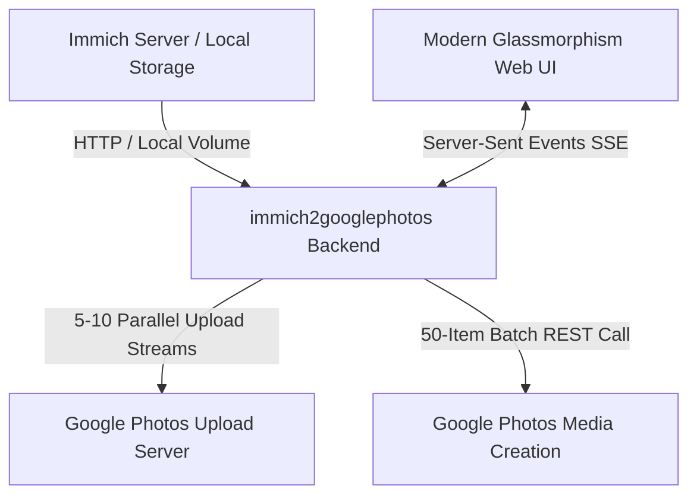

# Immich to Google Photos Migration Tool 🚀📸

> [!WARNING]
> **This project is in active development.** The API integrations and backend architecture are frequently updated to handle edge cases and enhance reliability. Please report any issues or unexpected behaviors on GitHub!

> **A high-performance, self-hosted web application to seamlessly transfer photos, videos, and albums from Immich to Google Photos with 100% original quality, EXIF metadata, and user-edited dates intact.**

[](#-docker--homelab-deployment)
[](LICENSE)
[](#-features)
[](#-features)

---

## 💬 Why This Tool Exists

Self-hosting (via incredible tools like **Immich**) is normally about taking control of your data, escaping cloud subscriptions, and avoiding big-tech lock-in.

However, real-world situations arise:
- You might need to shut down or scale back your Homelab (moving home, hardware changes, energy costs, or maintenance overhead).
- You or family members might miss specific cloud features, smart search capabilities, or Google Photos ecosystem integrations.
- You need a reliable, zero-loss migration bridge back to Google Photos without losing original quality, EXIF metadata, or album structures.

Even though moving *back* to the cloud might seem opposite to self-hosting philosophy, **true data ownership means having the freedom to move your media seamlessly in BOTH directions**. This tool was built to give self-hosters complete peace of mind and total control over their data library.

---

## 🌟 Highlights & Key Features

- ⚡ **5x–10x High-Performance Parallel Engine**: Features a multi-threaded parallel worker queue supporting **1 to 10 concurrent worker threads**, allowing 250+ media transfers in under 2 minutes.
- 📦 **Google Photos API Batching**: Accumulates media tokens into Google Photos `batchCreateMediaItems` requests, significantly reducing REST API roundtrips.
- 💎 **100% Bit-for-Bit Original Quality**: Streams original raw file bytes without any server-side re-encoding, resolution loss, or compression.
- 📅 **EXIF & User-Edited Date Fidelity**: Preserves camera EXIF, GPS location, and respects user-edited date/time corrections made inside the Immich UI (`fileCreatedAt` and `localDateTime`).
- 📁 **Instant Album Structure Replication**: Automatically creates matching albums in Google Photos and maps Immich photos/videos directly to their corresponding albums.
- 🛡️ **Zero GCP Cloud Setup Required**: Supports browser-to-backend OAuth Playground authentication out of the box—no complex Google Cloud Platform setup needed.
- 🔄 **Smart History & Deduplication**: Keeps track of migrated asset IDs in persistent local storage.
- 🕒 **Migration Sessions & Targeted Resets**: Every migration run is grouped into a "Session". You can view past sessions in the new History Modal and **reset specific sessions** to re-upload items without wiping the entire database.
- ✅ **Visual Migration Indicators**: The UI highlights previously migrated albums and individual assets with a green checkmark so you instantly know what's already been backed up.
- 🛠️ **Self-Healing Resiliency & Quota Management**: Smart exponential backoff (10s, 20s, 30s) automatically handles Google Photos API "Quota Exceeded" or `429 Too Many Requests` limits.
- ♻️ **Final Retry Queue**: Assets that fail after 3 attempts are placed in a special queue and retried sequentially at the very end of the migration for maximum success rates.
- ⚡ **Background Pre-fetching**: Loads massive libraries asynchronously while you configure your settings, completely eliminating UI freezing and loading spinners.
- 💻 **Live Terminal Dashboard**: A fully modernized concurrent monitoring dashboard showing active worker threads, upload streams, auto-retries, and color-coded real-time logs.
- 🐳 **Homelab & Docker Optimized**: Lightweight Alpine multi-stage Docker image, running on single port `3383` with optional direct local disk volume reading.

---

## 🛠️ Architecture Overview



---

## 🚀 Docker & Homelab Deployment

Deploying on a Raspberry Pi, NAS, or Homelab server takes under **1 minute**:

### Quick Start with Docker Compose

1. **Clone the repository:**
   ```bash
   git clone https://github.com/peakwick/immich2googlephotos.git
   cd immich2googlephotos
   ```

2. **Start the container:**
   ```bash
   docker compose up -d --build
   ```

3. **Access the Web Dashboard:**
   Open your browser and navigate to:
   ```text
   http://YOUR_SERVER_IP:3383
   ```

---

### Docker Compose Configuration (`docker-compose.yml`)

```yaml
services:
  immich2googlephotos:
    build:
      context: .
      dockerfile: Dockerfile
    container_name: immich2googlephotos
    restart: unless-stopped
    ports:
      - "3383:3383"
    volumes:
      - ./data:/app/server/data
      # Optional: Mount Immich local library directory for zero-latency local disk reading
      # - /path/to/immich/library:/data/upload:ro
    environment:
      - NODE_ENV=production
      - PORT=3383
```

---

## 📖 Step-by-Step Usage Guide

### 1. Connect Immich Server
- Enter your Immich Server URL (e.g., `http://192.168.1.21:2283`).
- Create an API Key in Immich (**Account Settings → API Keys → New API Key**).
- **Required Minimum Permissions:**
  - `Asset: Read` — To stream raw media files and EXIF metadata.
  - `Album: Read` — To list albums for Google Photos replication.

### 2. Connect Google Photos
- Click **Connect Google Photos Account**.
- Authorize with your Google Account using the integrated OAuth flow or paste your access token.

### 3. Select Migration Mode & Performance
Choose one of the 4 migration modes:
- 🧪 **Quick Test Batch (Safe Mode)**: Test with 1, 5, 10, or 50 items first.
- 🖼️ **Asset Picker**: Manually select individual photos and videos.
- 📁 **Album Picker**: Select specific Immich albums to replicate into Google Photos.
- 📚 **Full Library**: Transfer your entire photo & video collection.

**Adjust Parallel Speed:** Choose worker thread speed from **1 Thread (Sequential)** up to **10 Threads (Maximum Speed 🔥)**.

### 4. Start & Monitor
- Click **Start Migration**.
- Track real-time progress, speed in MB/s, estimated time remaining (ETA), and live log output.

---

## ⚠️ Known Limitations & Smart Workarounds

Due to API constraints imposed by third-party platforms, please keep the following limitations in mind:

### 1. 🌟 Favorites (Starred Photos)
- **Google Photos API Limitation**: Google Photos REST API does not expose an endpoint to programmatically set the "Favorite" (star ⭐️) flag on imported media items.
- **💡 Smart Workaround**:
  1. In Immich, select all your favorite photos and place them in a dedicated album named **"Favorites"**.
  2. Use this tool in **Album Mode** to replicate the **"Favorites"** album into Google Photos.
  3. Open Google Photos (Web or Mobile), open the migrated **"Favorites"** album, select all photos, and click the **Star / Favorite (⭐️)** button.
  4. Once starred, you can safely delete the temporary "Favorites" album. All starred photos will remain in your main timeline and Google Favorites collection!

### 2. 🔒 Locked Folder / Vault Items
- **Immich Privacy Constraint**: Assets stored in Immich's locked/vault storage cannot be accessed via standard API keys without user authorization and decryption.
- **💡 Workaround**: Temporarily move locked assets to a standard album inside Immich before running the migration, then re-lock them after transfer.

### 3. 🕒 User-Edited Dates vs. EXIF Injection
- **Google Photos API Limitation**: When uploading files via the API, Google Photos strictly reads the creation date from the embedded EXIF binary headers in the file. If you manually changed a date inside the Immich UI, the Immich database updates, but the raw file on disk does *not* change.
- **💡 The Ultimate Fix (exiftool)**: Our backend now utilizes `exiftool-vendored` and `perl` to safely and reliably rewrite the `AllDates` EXIF metadata of the file before uploading it to Google Photos. This works across all major formats including **JPEG, HEIC, and MP4 videos**. If a photo is flagged with a mismatched date, you can use the built-in **EXIF Date Diagnostics** tool to scan, fix, and migrate it with the correct timestamp so Google Photos places it perfectly in your timeline!

### 4. ♾️ Bypassing Immich's 250 Asset Search Limit
- **Technical Detail**: The Immich API (`POST /api/search/metadata`) strictly limits API queries to a maximum of 250 items per request, meaning "All Library" requests natively fail for large collections.
- **💡 Solution Implemented**: Our backend engine features a robust recursive pagination loop that queries `page 1, 2, 3...` iteratively. This guarantees that whether you have 500 or 50,000 photos, the engine will fetch 100% of your library without dropping a single asset.

---

## ⚙️ Environment Variables & Data Persistence

| Path / Variable | Description |
|---|---|
| `./data/settings.json` | Stores masked Immich server credentials & Google OAuth tokens. |
| `./data/migration_history.json` | Keeps track of migrated asset IDs for duplicate protection. |
| `PORT` | Container internal & external port (Default: `3383`). |

---

## 📄 License

Distributed under the MIT License. See `LICENSE` for more information.

---

## 🤝 Contributing & Feedback

Contributions, issues, and feature requests are welcome! Feel free to check out the [Issues Page](https://github.com/peakwick/immich2googlephotos/issues).

Made with ❤️ for the self-hosted & open-source community.
