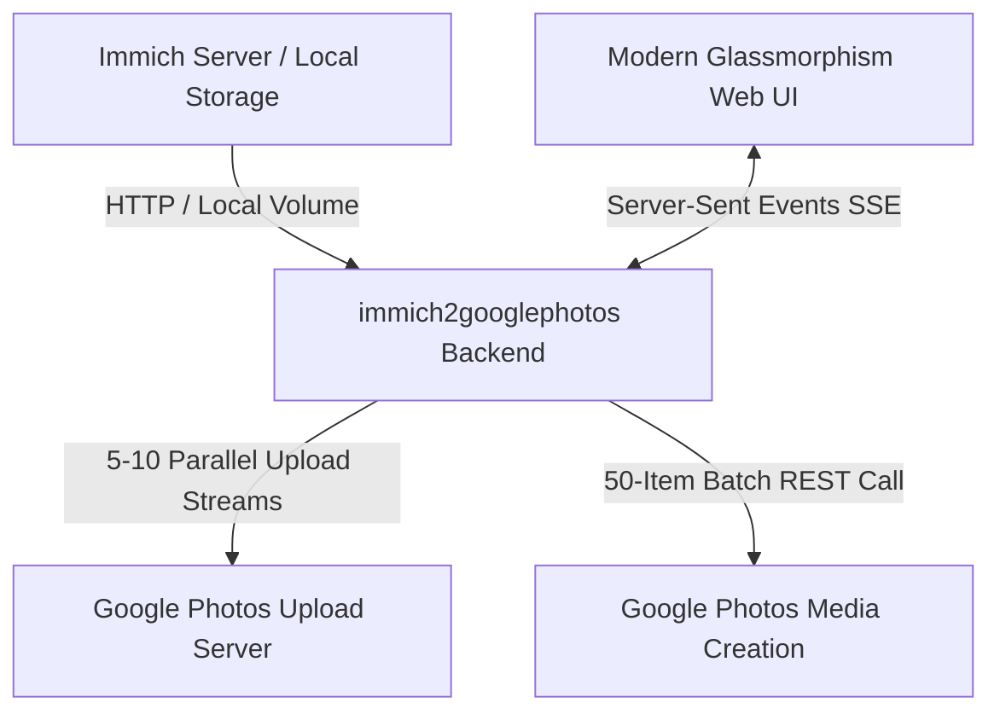

# Immich to Google Photos Migration Tool 🚀📸

> **A high-performance, self-hosted web application to seamlessly transfer photos, videos, and albums from Immich to Google Photos with 100% original quality, EXIF metadata, and user-edited dates intact.**

[](#-docker--homelab-deployment)
[](LICENSE)
[](#-features)
[](#-features)

---

## 🌟 Highlights & Key Features

- ⚡ **5x–8x High-Performance Parallel Engine**: Features a multi-threaded parallel worker queue supporting **1 to 10 concurrent worker threads**, allowing 250+ media transfers in under 2 minutes.
- 📦 **Google Photos 50-Item API Batching**: Accumulates media tokens into Google Photos `batchCreateMediaItems` requests (up to 50 items per call), reducing REST API roundtrips by 98%.
- 💎 **100% Bit-for-Bit Original Quality**: Streams original raw file bytes without any server-side re-encoding, resolution loss, or compression.
- 📅 **EXIF & User-Edited Date Fidelity**: Preserves camera EXIF, GPS location, and respects user-edited date/time corrections made inside the Immich UI (`fileCreatedAt` and `localDateTime`).
- 📁 **Instant Album Structure Replication**: Automatically creates matching albums in Google Photos and maps Immich photos/videos directly to their corresponding albums.
- 🛡️ **Zero GCP Cloud Setup Required**: Supports browser-to-backend OAuth Playground authentication out of the box—no complex Google Cloud Platform setup needed.
- 🔄 **Smart History & Deduplication**: Keeps track of migrated asset IDs in persistent local storage (`./data/migration_history.json`). Includes a one-click **Reset DB** feature to reset transfer history whenever needed.
- 🛠️ **Self-Healing Resiliency**: Automatic 3-attempt retry loop for individual upload hiccups or temporary Google API micro-latencies.
- 🐳 **Homelab & Docker Optimized**: Lightweight Alpine multi-stage Docker image, running on single port `3383` with optional direct local disk volume reading.

---

## 🛠️ Architecture Overview



---

## 🚀 Docker & Homelab Deployment

Deploying on a Raspberry Pi, NAS, or Homelab server takes under **1 minute**:

### Quick Start with Docker Compose

1. **Clone the repository:**
   ```bash
   git clone https://github.com/peakwick/immich2googlephotos.git
   cd immich2googlephotos
   ```

2. **Start the container:**
   ```bash
   docker compose up -d --build
   ```

3. **Access the Web Dashboard:**
   Open your browser and navigate to:
   ```text
   http://YOUR_SERVER_IP:3383
   ```

---

### Docker Compose Configuration (`docker-compose.yml`)

```yaml
services:
  immich2googlephotos:
    build:
      context: .
      dockerfile: Dockerfile
    container_name: immich2googlephotos
    restart: unless-stopped
    ports:
      - "3383:3383"
    volumes:
      - ./data:/app/server/data
      # Optional: Mount Immich local library directory for zero-latency local disk reading
      # - /path/to/immich/library:/data/upload:ro
    environment:
      - NODE_ENV=production
      - PORT=3383
```

---

## 📖 Step-by-Step Usage Guide

### 1. Connect Immich Server
- Enter your Immich Server URL (e.g., `http://192.168.1.21:2283`).
- Create an API Key in Immich (**Account Settings → API Keys → New API Key**).
- **Required Minimum Permissions:**
  - `Asset: Read` — To stream raw media files and EXIF metadata.
  - `Album: Read` — To list albums for Google Photos replication.

### 2. Connect Google Photos
- Click **Connect Google Photos Account**.
- Authorize with your Google Account using the integrated OAuth flow or paste your access token.

### 3. Select Migration Mode & Performance
Choose one of the 4 migration modes:
- 🧪 **Quick Test Batch (Safe Mode)**: Test with 1, 5, 10, or 50 items first.
- 🖼️ **Asset Picker**: Manually select individual photos and videos.
- 📁 **Album Picker**: Select specific Immich albums to replicate into Google Photos.
- 📚 **Full Library**: Transfer your entire photo & video collection.

**Adjust Parallel Speed:** Choose worker thread speed from **1 Thread (Sequential)** up to **10 Threads (Maximum Speed 🔥)**.

### 4. Start & Monitor
- Click **Start Migration**.
- Track real-time progress, speed in MB/s, estimated time remaining (ETA), and live log output.

---

## ⚙️ Environment Variables & Data Persistence

| Path / Variable | Description |
|---|---|
| `./data/settings.json` | Stores masked Immich server credentials & Google OAuth tokens. |
| `./data/migration_history.json` | Keeps track of migrated asset IDs for duplicate protection. |
| `PORT` | Container internal & external port (Default: `3383`). |

---

## 📄 License

Distributed under the MIT License. See `LICENSE` for more information.

---

## 🤝 Contributing & Feedback

Contributions, issues, and feature requests are welcome! Feel free to check out the [Issues Page](https://github.com/peakwick/immich2googlephotos/issues).

Made with ❤️ for the self-hosted & open-source community.
